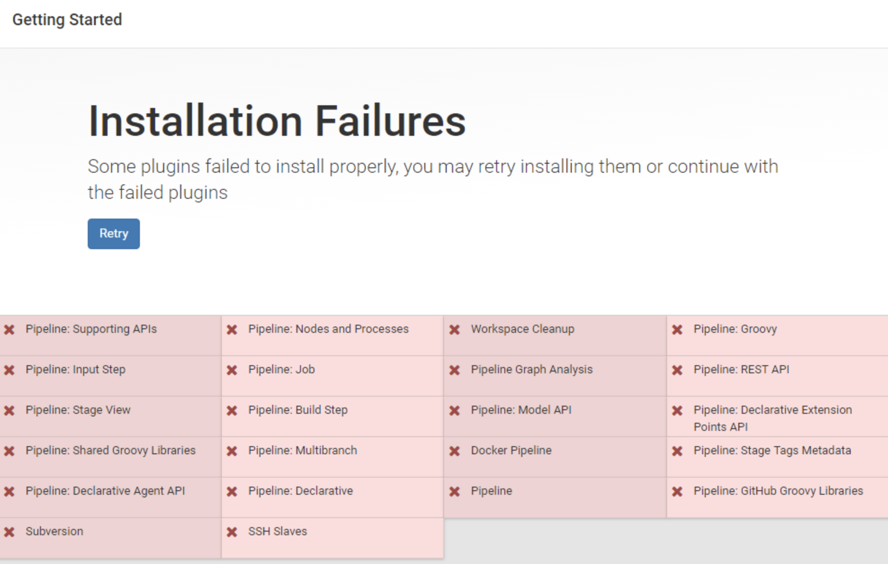
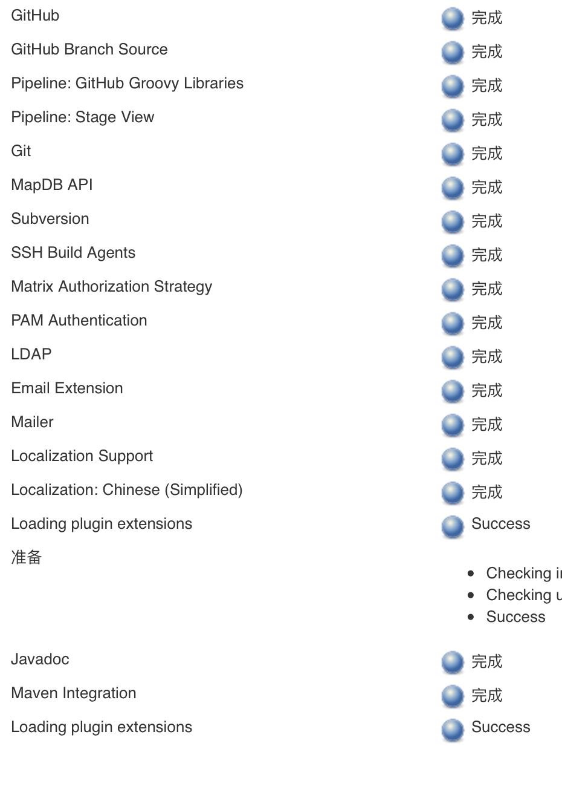
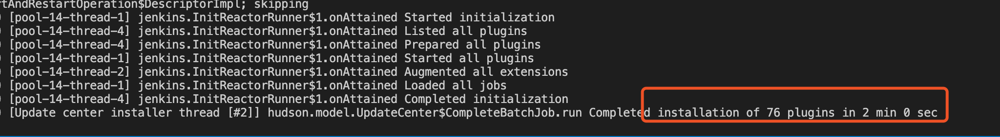

### 项目达成目的


解决jenkins在安装插件时,由于种种原因导致的安装失败或者请求超时问题

### 原因分析

Jenkins 在安装插件的时候,经常会出现,某些插件安装失败,在分析失败日志可以发现,是因为在请求 http://updates.jenkins-ci.org 地址时,出现请求超时,从而导致的安装失败



### 解决思路

超时的场景有两种:

    1. 点击获取可用插件时超时
    
    更改jenkins 默认的升级站点地址为 https://mirrors.tuna.tsinghua.edu.cn/jenkins/updates/update-center.json
    
    2. 下载插件超时
    
    分析update-center.json,我们可以发现,虽然时更改了升级站点的地址,但是获取到的插件仓库地址仍然时来源自 updates.jenkins-ci.org 这个服务站点的仓库,但是里面的插件我们都可以从清华的仓库中下载,因此我们在下载插件的时候,可以动些手脚
    
    首先,在jenkins所在服务器的 /etc/hosts 中,添加一条hosts 解析
    
    127.0.0.1 updates.jenkins-ci.org
    
    将访问原来仓库的请求拦截到本机上
    
    然后在本机上启动一个nginx进行代理,将上面的请求再次转发到 清华的仓库来执行
    
     location /download/plugins {
        proxy_next_upstream http_502 http_504 error timeout invalid_header;
        proxy_set_header Host mirrors.tuna.tsinghua.edu.cn;
        proxy_set_header X-Real-IP $remote_addr;
        proxy_set_header X-Forwarded-For $proxy_add_x_forwarded_for; 
        rewrite /download/plugins(.*) /jenkins/plugins/$1 break;
        proxy_pass https://mirrors.tuna.tsinghua.edu.cn;
    }
    
    从而解决了被Q的问题

### 项目说明

因为我的jenkins时采用docker容器的方式来部署的,因此,我将上述方案打包成了一个镜像来部署

首先来看下项目结构: 

```
src
├── Dockerfile.md    # 用于打包镜像的Dockerfile
├── apache-tomcat-8.5.51.tar.gz  # 加入一个tomcat,用来运行jenkins.war
├── jenkins.war     # jenkins.war 项目包
├── nginx.conf      # 用于代理的nginx配置信息
├── sources.list    # 替换默认的apt源的地址
└── startup.sh      # 镜像的启动脚本
```

将项目打包成镜像

```
docker build -t xxx/jenkins:latest .
```

启动容器
```
docker run -d --name jenkins -v /yourpath/:/opt/jenkins/ -p yourport:8080 xxx/jenkins:latest
```

虽然解决了联网请求的问题,在我们的实际操作中,可能还会遇到插件版本不兼容的问题,从而就要求我们去升级 jenkins 的版本

在这个项目中,升级版本也是很简单,从 Dockerfile 可以看出,预留了一个 
```
VOLUME [ "/opt/jenkins" ]
```

因此在启动容器时把这个宿主机的目录挂载上去,然后 在官网下载对应版本的 jenkins.war 包 放进去,然后重启容器即可

### 最终效果



2 分钟下载安装完成了 76 了插件!!